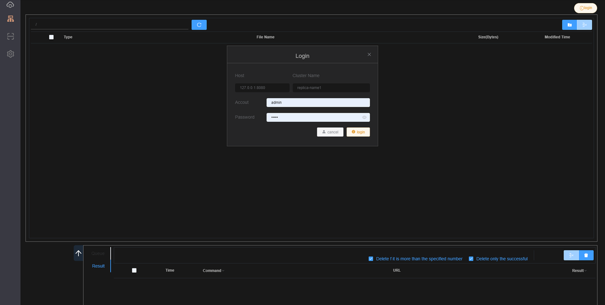
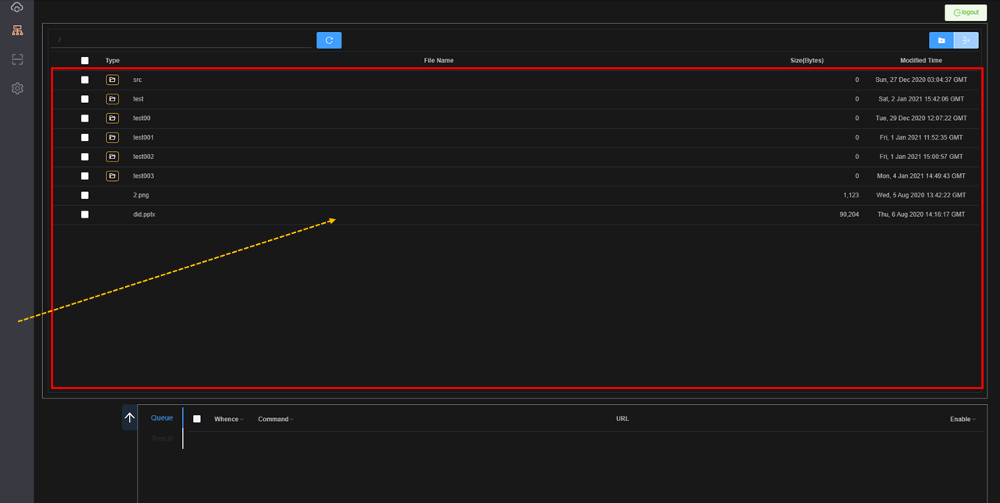
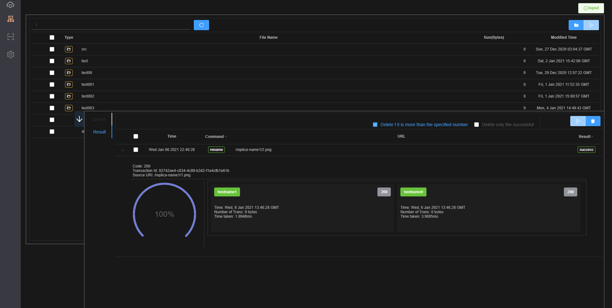
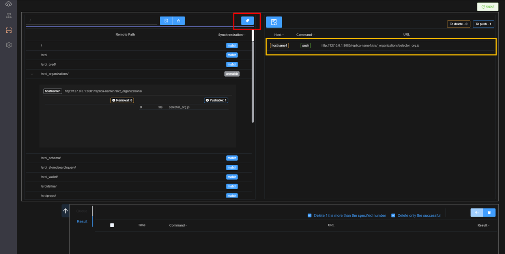
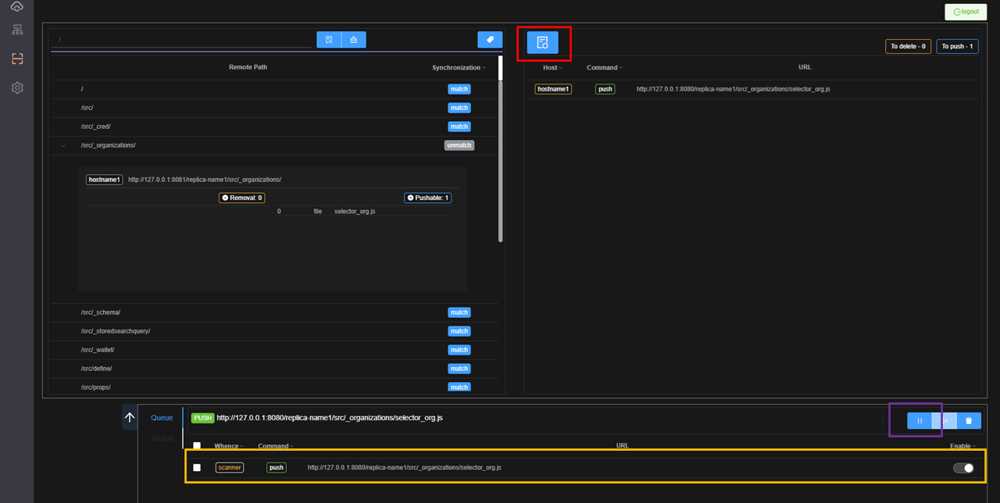
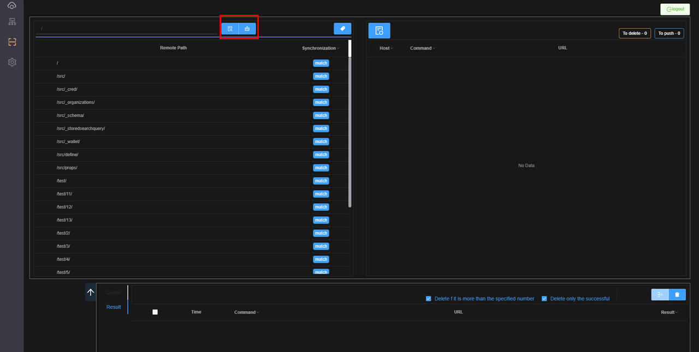
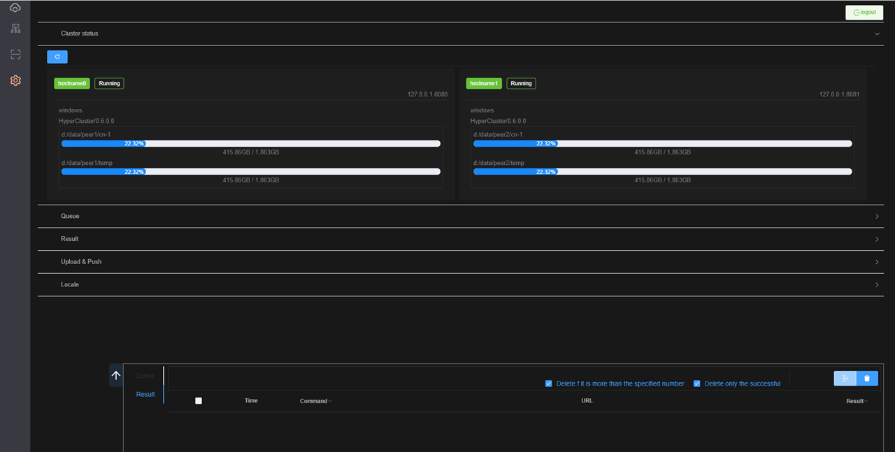

# Explorer

***Version 0.6.X.X Explorer 안내서.***

----
### 로그인

### 업로드
아래 화면은 탐색기입니다.
업로드는 빨간색 사각형 영역으로 파일 또는 폴더를 드래그 & 드랍한 후 대기열의 시작 버튼을 클릭하면 진행됩니다.
결과는 결과 화면에서 확인이 가능합니다.

!!! note ""
    업로드가 완료되는 즉시 `cluster`에 연결되어 있는 모든 `peer`에게 반영된 상태로 동기화가 되어 있는 것을 확인 하실수 있습니다.

### 동기화 결과

### 폴더 또는 파일 비교분석
탐색기화면에서 폴더 또는 파일에 마우스 우클릭으로 Scan을 클릭하거나 아래 그림처럼 빨간사각형에 폴더 또는 파일명을 입력합니다. 그리고 빨간색 사각형 안의 버튼을 클릭합니다.
그러면 `leader peer`를 기준으로 빨강색에서 입력한 값을 `cluster`에 연결되어 있는 모든 `peer`들을 대상으로 비교분석합니다.

### 비교분석 결과
아래 그림은 비교분석 결과이며 하나의 파일이 누락되어 있거나 `leader peer`의 파일과 다르다는 것을 알 수 있습니다.
빨간색 사각형의 버튼을 눌러 분석결과를 자세히 확인 할 수 있습니다

### 대기열 추가 및 동기화
분석결과를 확인 하였으니 동기화를 하도록 합니다.
빨간색 사각형의 버튼을 클릭하여 대기열에 추가 한후 보라색 버튼을 클릭하여 동기화를 합니다

### 다시 폴더 또는 파일 비교분석
동기화가 되었는지 결과는 결과화면으로 확인을 하면 되지만 `scan`을 이용하여 전체적인 동기화 상태를 확인하여도 됩니다.
아래 그림처럼 빨강색 사각형의 우측 버튼을 클릭하여 리스트를 지운 후 좌측의 버튼을 클릭하여 다시 비교분석을 합니다.
결과는 동기화가 100% 일치한 상태로 나왔습니다.

### 설정
설정화면에서 Cluster의 상태를 확인 할 수 있습니다.

            

    

