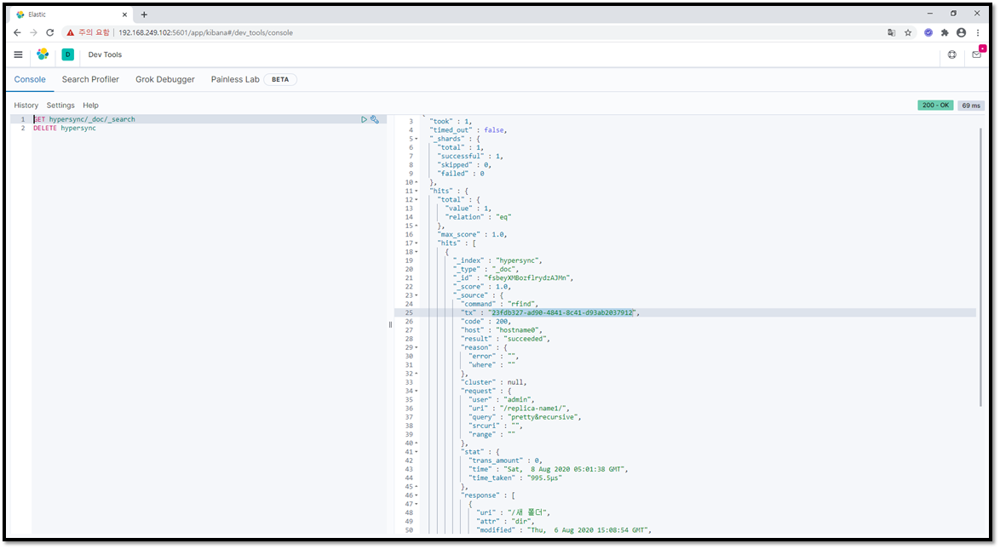

# Replica

Replica 설정은 실 시간 동기화가 가능한 설정으로
Windows **Single-Host** 환경에서 4개의 `peer`로 Clustering이 가능하도록 구성하겠습니다.

-------------

## 환경변수 설정

* `HYPERCLUSTER_PEER_PREFERENCE_FILE` = D:/project/workspace/http/server/config/preference.yaml
* `HYPERCLUSTER_PEER_LOG_PREFERENCE_FILE` = D:/project/workspace/http/server/config/log.yaml
* `HYPERCLUSTER_PEER_TLS_ENABLE` = DISABLE
* `HYPERCLUSTER_PEER_HOSTNAME` 는 `peer`를 실행할 때 별도로 설정하여야 합니다

리부팅 없이 환경변수를 적용하기 위해 아래 명령을 실행 합니다.
```
c:\>set
```
-----

## 실 시간 동기화를 위한 환경 설정

환경설정 파일은  환경변수 `HYPERCLUSTER_PEER_PREFERENCE_FILE` 으로 설정된 파일입니다
```
#####################################################
#
#	Hyper-Cluster Sync for CDN
#
#
#
#	  					2020.08.01
# 					 DAESEOB.JEONG
#
#####################################################

#####################################################      
#Section: volumes
#####################################################      
volumes:
  volume-name1: 
    temporary: d:/data/peer1/temp
    service: d:/data/peer1/cn-1
  volume-name2: 
    temporary: d:/data/peer2/temp
    service: d:/data/peer2/cn-1
  volume-name3: 
    temporary: d:/data/peer3/temp
    service: d:/data/peer3/cn-1        
  volume-name4: 
    temporary: d:/data/peer4/temp
    service: d:/data/peer4/cn-1         

#####################################################      
#Section: peers  
#####################################################      
 peers:
  hostname0:
    addr: 127.0.0.1:8080
    volumes: 
      repo-name1: volume-name1
      repo-name2:
        temporary: d:/data/peer1/temp
        service: d:/data/peer1/cn-2 
  hostname1:
    addr: 127.0.0.1:8081
    volumes: 
      repo-name1: volume-name2
      repo-name2: 
        temporary: d:/data/peer2/temp
        service: d:/data/peer2/cn-2
  hostname2:
    addr: 127.0.0.1:8082
    volumes: 
      repo-name1: volume-name3
  hostname3:
    addr: 127.0.0.1:8083
    volumes: 
      repo-name1: volume-name4
   
#####################################################      
#Section: users
#####################################################      
users:
  admin:
    pwd: admin
  user1:
    pwd: user1						

#####################################################      
#Section: cluster          
#####################################################      
cluster: 
  replica-name1:
    role: replica
    #elasticsearch-url: http://192.168.249.102:9200/hypersync/_doc #ACCESS Logging
    peers:
      hostname0: 
        volume: repo-name1
      hostname1: 
        volume: repo-name1
      hostname2: 
        volume: repo-name1
      hostname3: 
        volume: repo-name1
    users:
      admin:
        grant: rwds
      user1:
        grant: r
      anonymous:
        grant: r
```

-----

### volume 설정
* 4개의 `peer`에서 각각 다른 `volume`을 사용하도록 `volumes`섹션에서 4개의 `named-volume`을 생성하고 `mount`합니다.
	* `mount` 된 `named-volume`은 **volume-name1**, **volume-name2**, **volume-name3**, **volume-name4** 입니다.
```
#####################################################      
#Section: volumes
#####################################################      
volumes:
  volume-name1: 
    temporary: d:/data/peer1/temp
    service: d:/data/peer1/cn-1
  volume-name2: 
    temporary: d:/data/peer2/temp
    service: d:/data/peer2/cn-1
  volume-name3: 
    temporary: d:/data/peer3/temp
    service: d:/data/peer3/cn-1        
  volume-name4: 
    temporary: d:/data/peer4/temp
    service: d:/data/peer4/cn-1         
```

-----

### peer 설정 방법
* `peers`섹션에 4개의 `peer` **hostname0**, **hostname1**, **hostname2**, **hostname3** 를 준비합니다.
* `peer`와 `peer`간 통신 과 `user(사용자)`가 접속이 가능한 `IP:Port` 를 각 `peers.{hostname}.addr`에 설정합니다.

!!! tip "참고"
    ***{hostname}***는 `peers`섹션에서 준비한 `peer` 이름입니다. 

* 그리고 마지막으로 `peer`에서 사용 할  `volume`을  `peers.{hostname}.volumes.{named-volume}`에 설정합니다
	
    1. `peers.{hostname}.volumes`에 `named-volume`를 등록합니다.
    2. `volumes`섹션에서 `mount`한 `named-volume`을 `peers.{hostname}.volumes.{named-volume}`와 연결합니다.
		
```
 peers:
  hostname0:
    addr: 127.0.0.1:8080
    volumes: 
      repo-name1: volume-name1
      repo-name2:
        temporary: d:/data/peer1/temp
        service: d:/data/peer1/cn-2 
  hostname1:
    addr: 127.0.0.1:8081
    volumes: 
      repo-name1: volume-name2
      repo-name2: 
        temporary: d:/data/peer2/temp
        service: d:/data/peer2/cn-2
  hostname2:
    addr: 127.0.0.1:8082
    volumes: 
      repo-name1: volume-name3
  hostname3:
    addr: 127.0.0.1:8083
    volumes: 
      repo-name1: volume-name4
```

!!! tip "참고"
    `peer`의 `volume` 은 여러개 등록 가능합니다.

-----

### cluster 설정
`cluster`섹션은 여러 개의 `named-cluster`등록이 가능하지만 본 ***Tutorials***에서는 **replica**역할이 가능한 `cluster`하나만 등록하도록 하겠습니다.

* `cluster`섹션에 **replica-name1**이라는 `named-cluster`를 등록 합니다.
* `cluster.replica-name1.role`에 **replica**로 설정하여  **replica-name1**은 `실 시간 동기화`가 가능하도록 설정합니다.

*  **replica-name1**에 참여 할 `peer`를 `peers`센션에서 준비한 `peer`를 선택하여  `cluster.{named-cluster}.peers`에 등록 합니다.

!!! tip "참고"
    `cluster`에 등록한 `named-cluster`는 **replica-name1** 입니다.    
    다시 말 하면 `{named-cluster}`부분을 **replica-name1**으로 변경하면 됩니다.

* 다음은 `cluster`에 참여한 `peer`들이 사용 할 `volume`을 선택합니다.
  `cluster.{named-cluster}.peers.{hostname}.volume`에 `peers.{hostname}.volumes`에서 `mount`한
  `named-volume`을 사용하도록 등록합니다.

    * `cluster.replica-name1.peers.hostname0.volume`는 `peers.hostname0.volumes`에서 등록한 `named-volume` `repo-name1`를 연결합니다.
    * `cluster.replica-name1.peers.hostname1.volume`는 `peers.hostname1.volumes`에서 등록한 `named-volume` `repo-name1`를 연결합니다.
    * `cluster.replica-name1.peers.hostname2.volume`는 `peers.hostname1.volumes`에서 등록한 `named-volume` `repo-name1`를 연결합니다.
    * `cluster.replica-name1.peers.hostname3.volume`는 `peers.hostname1.volumes`에서 등록한 `named-volume` `repo-name1`를 연결합니다.


* 끝으로 **replica-name1**을 사용할 `user` 와 `grant`를 등록 설정합니다.
	* 등록가능한 `user`는 `users`섹션에 등록이 되어 있어야 합니다.

```
cluster: 
  replica-name1:
    role: replica
    #elasticsearch-url: http://192.168.249.102:9200/hypersync/_doc #ACCESS Logging
    peers:
      hostname0: 
        volume: repo-name1
      hostname1: 
        volume: repo-name1
      hostname2: 
        volume: repo-name1
      hostname3: 
        volume: repo-name1
    users:
      admin:
        grant: rwds
      user1:
        grant: r
      anonymous:
        grant: r
```
!!! tip
    `cluster.replica-name1.elasticsearch-url`은 `access log`가 저장 될 `ElasticSearch`의 URL 정보입니다.



-------------

## peer 실행하기

###  `peers.hostname0` 실행하기
* 환경 변수 `HYPERCLUSTER_PEER_HOSTNAME`를 `hostname0`으로 설정합니다.
* 설치한 경로로 이동하여 `hypercluster`를 실행 합니다.
```
c:>hypercluster
```

###  `peers.hostname1` 실행하기
* 환경 변수 `HYPERCLUSTER_PEER_HOSTNAME`를 `hostname1`으로 설정합니다.
* 설치한 경로로 이동하여 `hypercluster`를 실행 합니다.
```
c:>hypercluster
```

###  `peers.hostname2` 실행하기
* 환경 변수 `HYPERCLUSTER_PEER_HOSTNAME`를 `hostname2`으로 설정합니다.
* 설치한 경로로 이동하여 `hypercluster`를 실행 합니다.
```
c:>hypercluster
```

###  `peers.hostname3` 실행하기
* 환경 변수 `HYPERCLUSTER_PEER_HOSTNAME`를 `hostname3`으로 설정합니다.
* 설치한 경로로 이동하여 `hypercluster`를 실행 합니다.
```
c:>hypercluster
```
