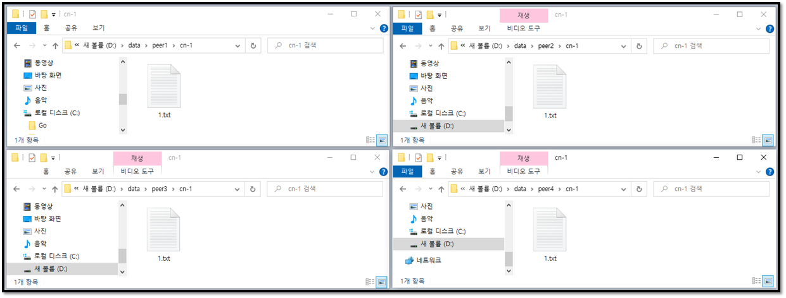

# Synchronization API

   ***본 Tutorial은 API 사용 방법을 포함합니다.***

  [[Setting up an Replica On Single-Host]](replica.md)에서 설명 했던 **Cluster** 구성으로 Tutorial을 진행합니다.
  

----

## API 사용방법

!!! tip ""
    우리는 API 호출을 위해 ***Chrome Talend API Test Tool***을 사용 할 것입니다.    
    그리고 HTTP Request와 Request 결과 JSON만을 제공 할 것이고
    업로드 API 사용방법만 화면 캡쳐를 포함하여 제공합니다.

----

## 업로드

##### 업로드 전 peer volume 확인
그림을 보면 모든 `peer`의 `volume`은 파일이 없는 상태입니다.


 
##### 업로드 요청
20bytes 크기의 1.txt 파일을 업로드 합니다.

!!! tip ""
    Upload API

```
PUT /replica-name1/1.txt?pretty&cluster HTTP/1.1
Host: 127.0.0.1:8080
Connection: Close
Authorization: Basic YWRtaW46YWRtaW4=
Content-Length: 20

12345678901234567890
```

!!! danger ""
    Chrome의 Talend API Test 툴을 사용하여 업로드 합니다.    
    uri query에 pretty를 추가 하시면 가독성이 좋은 JSON으로 응답을 받을 수 있습니다.


!!! danger ""
    ***Chrome Talend API Test Tool***를 이용한 파일 업로드 방법은 아래 그림과 같이      
    좌측 영역 HEADERS에서 `Content-Length`를 삭제하고 우측 BODY영역에서 File을 선택하면 파일 업로드가 가능합니다.     
    


##### 업로드 결과
`peer`의 `volume`에서 20bytes의 1.txt를 확인합니다.




업로드 요청 결과는 아래 JSON과 같이 ***Chrome Talend API Test Tool***에서 확인 가능합니다.
```
{
  "tx": "1230c013-6076-4297-bfd0-4af08057d8d3",
  "code": 200,
  "Succeeded": 4,
  "Failed": 0,
  "results": [
    {
      "command": "upload",
      "tx": "1230c013-6076-4297-bfd0-4af08057d8d3",
      "code": 200,
      "host": "hostname2",
      "result": "succeeded",
      "reason": {
        "error": "",
        "where": ""
      },
      "cluster": {
        "cluster_name": "replica-name1",
        "cluster_role": "replica",
        "peers": "hostname0,hostname1,hostname2,hostname3",
        "peers_count": 4,
        "lead_peer": "hostname0",
        "child_peers": ""
      },
      "request": {
        "user": "admin",
        "uri": "/replica-name1/1.txt",
        "query": "pretty",
        "srcuri": "",
        "range": ""
      },
      "stat": {
        "trans_amount": 20,
        "time": "Tue,  4 Aug 2020 12:39:55 GMT",
        "time_taken": "9.9731ms"
      },
      "response": null
    },
    {
      "command": "upload",
      "tx": "1230c013-6076-4297-bfd0-4af08057d8d3",
      "code": 200,
      "host": "hostname3",
      "result": "succeeded",
      "reason": {
        "error": "",
        "where": ""
      },
      "cluster": {
        "cluster_name": "replica-name1",
        "cluster_role": "replica",
        "peers": "hostname0,hostname1,hostname2,hostname3",
        "peers_count": 4,
        "lead_peer": "hostname0",
        "child_peers": ""
      },
      "request": {
        "user": "admin",
        "uri": "/replica-name1/1.txt",
        "query": "pretty",
        "srcuri": "",
        "range": ""
      },
      "stat": {
        "trans_amount": 20,
        "time": "Tue,  4 Aug 2020 12:39:55 GMT",
        "time_taken": "8.9733ms"
      },
      "response": null
    },
    {
      "command": "upload",
      "tx": "1230c013-6076-4297-bfd0-4af08057d8d3",
      "code": 200,
      "host": "hostname1",
      "result": "succeeded",
      "reason": {
        "error": "",
        "where": ""
      },
      "cluster": {
        "cluster_name": "replica-name1",
        "cluster_role": "replica",
        "peers": "hostname0,hostname1,hostname2,hostname3",
        "peers_count": 4,
        "lead_peer": "hostname0",
        "child_peers": "hostname3"
      },
      "request": {
        "user": "admin",
        "uri": "/replica-name1/1.txt",
        "query": "pretty",
        "srcuri": "",
        "range": ""
      },
      "stat": {
        "trans_amount": 20,
        "time": "Tue,  4 Aug 2020 12:39:55 GMT",
        "time_taken": "11.9689ms"
      },
      "response": null
    },
    {
      "command": "upload",
      "tx": "1230c013-6076-4297-bfd0-4af08057d8d3",
      "code": 200,
      "host": "hostname0",
      "result": "succeeded",
      "reason": {
        "error": "",
        "where": ""
      },
      "cluster": {
        "cluster_name": "replica-name1",
        "cluster_role": "replica",
        "peers": "hostname0,hostname1,hostname2,hostname3",
        "peers_count": 4,
        "lead_peer": "hostname0",
        "child_peers": "hostname1,hostname2"
      },
      "request": {
        "user": "admin",
        "uri": "/replica-name1/1.txt",
        "query": "pretty",
        "srcuri": "",
        "range": ""
      },
      "stat": {
        "trans_amount": 20,
        "time": "Tue,  4 Aug 2020 12:39:55 GMT",
        "time_taken": "16.9555ms"
      },
      "response": null
    }
  ]
}
```

!!! tip ""
    ***결과 필드 설명***    

* 요청 처리 결과 집계    
`tx`: transaction id    
`code`: http code    
`Succeeded`: 성공 수   
`Failed`: 실패 수    

* 요청 처리 결과     
`results[].command`: request 명령    
`results[].tx`: transaction id     
`results[].code`: http code    
`results[].host`: peer의 hostname    
`results[].result`: request 명령 처리 결과     
`results[].reason.error`: request 명령 처리 결과 실패 원인    
`results[].reason.where`: request 명령 처리 결과 실패 위치    

* cluster 정보    
`results[].cluster.cluster_name`: named-cluster    
`results[].cluster.cluster_role`: cluster 역할    
`results[].cluster.peers`: cluster에 참여한 peer    
`results[].cluster.peers_count`: cluster에 참여한 peer 수     
`results[].cluster.lead_peer`: lead peer    
`results[].cluster.child_peers`: child peer    

* request 정보    
`results[].request.user`: 사용자    
`results[].request.uri`: uri 정보    
`results[].request.query`: uri query 정보    
`results[].request.srcuri`: 요청한 http header의 source uri 정보    
`results[].request.range`: 요청한 http header의 range 정보    

* 통계    
`results[].stat.trans_amount`: 전송량    
`results[].stat.time`: 요청 처리 시작 시간    
`results[].stat.time_taken`: 요청 처리에 걸린 시간    

* 추가 정보    
`results[].response`: request 처리 결과의 추가 정보     

----

## 폴더 만들기

##### 폴더 만들기 요청

**새 폴더**를 만들겠습니다.    
요청 한 `uri`가 Directory라고 `peer`가 인식하기 위해서는 `uri`의 마지막은 `/`으로 끝나야 합니다.
`/`으로 끝나지 않으면 파일로 생성됩니다.

!!! tip ""
    Create Directory API

```
PUT /replica-name1/새 폴더/?pretty&cluster HTTP/1.1
Host: 127.0.0.1:8080
Connection: Close
Authorization: Basic YWRtaW46YWRtaW4=
```

##### 폴더 만들기 결과

```
{
  "tx": "656e5d1b-be3a-4341-b7ab-d04fedd836b3",
  "code": 200,
  "Succeeded": 4,
  "Failed": 0,
  "results": [
    {
      "command": "mkdir",
      "tx": "656e5d1b-be3a-4341-b7ab-d04fedd836b3",
      "code": 200,
      "host": "hostname2",
      "result": "succeeded",
      "reason": {
        "error": "",
        "where": ""
      },
      "cluster": {
        "cluster_name": "replica-name1",
        "cluster_role": "replica",
        "peers": "hostname0,hostname1,hostname2,hostname3",
        "peers_count": 4,
        "lead_peer": "hostname0",
        "child_peers": ""
      },
      "request": {
        "user": "admin",
        "uri": "/replica-name1/새 폴더/",
        "query": "pretty",
        "srcuri": "",
        "range": ""
      },
      "stat": {
        "trans_amount": 0,
        "time": "Thu,  6 Aug 2020 14:18:52 GMT",
        "time_taken": "995.3µs"
      },
      "response": null
    },
    {
      "command": "mkdir",
      "tx": "656e5d1b-be3a-4341-b7ab-d04fedd836b3",
      "code": 200,
      "host": "hostname3",
      "result": "succeeded",
      "reason": {
        "error": "",
        "where": ""
      },
      "cluster": {
        "cluster_name": "replica-name1",
        "cluster_role": "replica",
        "peers": "hostname0,hostname1,hostname2,hostname3",
        "peers_count": 4,
        "lead_peer": "hostname0",
        "child_peers": ""
      },
      "request": {
        "user": "admin",
        "uri": "/replica-name1/새 폴더/",
        "query": "pretty",
        "srcuri": "",
        "range": ""
      },
      "stat": {
        "trans_amount": 0,
        "time": "Thu,  6 Aug 2020 14:18:52 GMT",
        "time_taken": "1.9938ms"
      },
      "response": null
    },
    {
      "command": "mkdir",
      "tx": "656e5d1b-be3a-4341-b7ab-d04fedd836b3",
      "code": 200,
      "host": "hostname1",
      "result": "succeeded",
      "reason": {
        "error": "",
        "where": ""
      },
      "cluster": {
        "cluster_name": "replica-name1",
        "cluster_role": "replica",
        "peers": "hostname0,hostname1,hostname2,hostname3",
        "peers_count": 4,
        "lead_peer": "hostname0",
        "child_peers": ""
      },
      "request": {
        "user": "admin",
        "uri": "/replica-name1/새 폴더/",
        "query": "pretty",
        "srcuri": "",
        "range": ""
      },
      "stat": {
        "trans_amount": 0,
        "time": "Thu,  6 Aug 2020 14:18:52 GMT",
        "time_taken": "1.9938ms"
      },
      "response": null
    },
    {
      "command": "mkdir",
      "tx": "656e5d1b-be3a-4341-b7ab-d04fedd836b3",
      "code": 200,
      "host": "hostname0",
      "result": "succeeded",
      "reason": {
        "error": "",
        "where": ""
      },
      "cluster": {
        "cluster_name": "replica-name1",
        "cluster_role": "replica",
        "peers": "hostname0,hostname1,hostname2,hostname3",
        "peers_count": 4,
        "lead_peer": "hostname0",
        "child_peers": "hostname1,hostname2,hostname3"
      },
      "request": {
        "user": "admin",
        "uri": "/replica-name1/새 폴더/",
        "query": "pretty",
        "srcuri": "",
        "range": ""
      },
      "stat": {
        "trans_amount": 0,
        "time": "Thu,  6 Aug 2020 14:18:52 GMT",
        "time_taken": "6.9818ms"
      },
      "response": null
    }
  ]
}
```
----

## 복사하기

##### 복사하기 요청

**/1.txt** 파일을 **/새 폴더/1.txt**로 복사합니다.

!!! tip ""
    Copy API

```
PUT /replica-name1/새 폴더/1.txt?pretty&cluster HTTP/1.1
Host: 127.0.0.1:8080
Connection: Close
Authorization: Basic YWRtaW46YWRtaW4=
X-Hyper-Copy-Source: /replica-name1/1.txt
```

##### 복사하기 결과

```
{
  "tx": "9a855db3-bddd-47d7-aab0-302bc64a48dc",
  "code": 200,
  "Succeeded": 4,
  "Failed": 0,
  "results": [
    {
      "command": "copy",
      "tx": "9a855db3-bddd-47d7-aab0-302bc64a48dc",
      "code": 200,
      "host": "hostname1",
      "result": "succeeded",
      "reason": {
        "error": "",
        "where": ""
      },
      "cluster": {
        "cluster_name": "replica-name1",
        "cluster_role": "replica",
        "peers": "hostname0,hostname1,hostname2,hostname3",
        "peers_count": 4,
        "lead_peer": "hostname0",
        "child_peers": ""
      },
      "request": {
        "user": "admin",
        "uri": "/replica-name1/새 폴더/1.txt",
        "query": "pretty",
        "srcuri": "/replica-name1/1.txt",
        "range": ""
      },
      "stat": {
        "trans_amount": 0,
        "time": "Thu,  6 Aug 2020 14:37:34 GMT",
        "time_taken": "125.2044ms"
      },
      "response": null
    },
    {
      "command": "copy",
      "tx": "9a855db3-bddd-47d7-aab0-302bc64a48dc",
      "code": 200,
      "host": "hostname3",
      "result": "succeeded",
      "reason": {
        "error": "",
        "where": ""
      },
      "cluster": {
        "cluster_name": "replica-name1",
        "cluster_role": "replica",
        "peers": "hostname0,hostname1,hostname2,hostname3",
        "peers_count": 4,
        "lead_peer": "hostname0",
        "child_peers": ""
      },
      "request": {
        "user": "admin",
        "uri": "/replica-name1/새 폴더/1.txt",
        "query": "pretty",
        "srcuri": "/replica-name1/1.txt",
        "range": ""
      },
      "stat": {
        "trans_amount": 0,
        "time": "Thu,  6 Aug 2020 14:37:34 GMT",
        "time_taken": "125.2066ms"
      },
      "response": null
    },
    {
      "command": "copy",
      "tx": "9a855db3-bddd-47d7-aab0-302bc64a48dc",
      "code": 200,
      "host": "hostname2",
      "result": "succeeded",
      "reason": {
        "error": "",
        "where": ""
      },
      "cluster": {
        "cluster_name": "replica-name1",
        "cluster_role": "replica",
        "peers": "hostname0,hostname1,hostname2,hostname3",
        "peers_count": 4,
        "lead_peer": "hostname0",
        "child_peers": ""
      },
      "request": {
        "user": "admin",
        "uri": "/replica-name1/새 폴더/1.txt",
        "query": "pretty",
        "srcuri": "/replica-name1/1.txt",
        "range": ""
      },
      "stat": {
        "trans_amount": 0,
        "time": "Thu,  6 Aug 2020 14:37:34 GMT",
        "time_taken": "151.8515ms"
      },
      "response": null
    },
    {
      "command": "copy",
      "tx": "9a855db3-bddd-47d7-aab0-302bc64a48dc",
      "code": 200,
      "host": "hostname0",
      "result": "succeeded",
      "reason": {
        "error": "",
        "where": ""
      },
      "cluster": {
        "cluster_name": "replica-name1",
        "cluster_role": "replica",
        "peers": "hostname0,hostname1,hostname2,hostname3",
        "peers_count": 4,
        "lead_peer": "hostname0",
        "child_peers": "hostname1,hostname2,hostname3"
      },
      "request": {
        "user": "admin",
        "uri": "/replica-name1/새 폴더/1.txt",
        "query": "pretty",
        "srcuri": "/replica-name1/1.txt",
        "range": ""
      },
      "stat": {
        "trans_amount": 0,
        "time": "Thu,  6 Aug 2020 14:37:34 GMT",
        "time_taken": "154.8079ms"
      },
      "response": null
    }
  ]
}
```

----

## 이름 바꾸기

##### 이름 바꾸기 요청

**/새 폴더/1.txt**를 **/2.txt**로 폴더 이동과 이름 바꾸기를 하겠습니다.
그리고 지금 부터`perrty query`를 생략 하겠습니다.

!!! tip ""
    Rename API

```
PUT /replica-name1/2.txt?cluster HTTP/1.1
Host: 127.0.0.1:8080
Connection: Close
Authorization: Basic YWRtaW46YWRtaW4=
X-Hyper-Rename-Source: /replica-name1/%EC%83%88%20%ED%8F%B4%EB%8D%94/1.txt
```

##### 이름 바꾸기 결과

```
{"tx":"0010e66f-00dd-437d-bafe-ba4c3912fc89","code":200,"Succeeded":4,"Failed":0,"results":[{"command":"rename","tx":"0010e66f-00dd-437d-bafe-ba4c3912fc89","code":200,"host":"hostname1","result":"succeeded","reason":{"error":"","where":""},"cluster":{"cluster_name":"replica-name1","cluster_role":"replica","peers":"hostname0,hostname1,hostname2,hostname3","peers_count":4,"lead_peer":"hostname0","child_peers":""},"request":{"user":"admin","uri":"/replica-name1/2.txt","query":"","srcuri":"/replica-name1/새 폴더/1.txt","range":""},"stat":{"trans_amount":0,"time":"Thu,  6 Aug 2020 15:08:54 GMT","time_taken":"996µs"},"response":null},{"command":"rename","tx":"0010e66f-00dd-437d-bafe-ba4c3912fc89","code":200,"host":"hostname2","result":"succeeded","reason":{"error":"","where":""},"cluster":{"cluster_name":"replica-name1","cluster_role":"replica","peers":"hostname0,hostname1,hostname2,hostname3","peers_count":4,"lead_peer":"hostname0","child_peers":""},"request":{"user":"admin","uri":"/replica-name1/2.txt","query":"","srcuri":"/replica-name1/새 폴더/1.txt","range":""},"stat":{"trans_amount":0,"time":"Thu,  6 Aug 2020 15:08:54 GMT","time_taken":"0s"},"response":null},{"command":"rename","tx":"0010e66f-00dd-437d-bafe-ba4c3912fc89","code":200,"host":"hostname3","result":"succeeded","reason":{"error":"","where":""},"cluster":{"cluster_name":"replica-name1","cluster_role":"replica","peers":"hostname0,hostname1,hostname2,hostname3","peers_count":4,"lead_peer":"hostname0","child_peers":""},"request":{"user":"admin","uri":"/replica-name1/2.txt","query":"","srcuri":"/replica-name1/새 폴더/1.txt","range":""},"stat":{"trans_amount":0,"time":"Thu,  6 Aug 2020 15:08:54 GMT","time_taken":"997.8µs"},"response":null},{"command":"rename","tx":"0010e66f-00dd-437d-bafe-ba4c3912fc89","code":200,"host":"hostname0","result":"succeeded","reason":{"error":"","where":""},"cluster":{"cluster_name":"replica-name1","cluster_role":"replica","peers":"hostname0,hostname1,hostname2,hostname3","peers_count":4,"lead_peer":"hostname0","child_peers":"hostname1,hostname2,hostname3"},"request":{"user":"admin","uri":"/replica-name1/2.txt","query":"","srcuri":"/replica-name1/새 폴더/1.txt","range":""},"stat":{"trans_amount":0,"time":"Thu,  6 Aug 2020 15:08:54 GMT","time_taken":"1.9938ms"},"response":null}]}
```

----

## 파일 수정 시간 변경 

##### 파일 수정 시간 변경 요청

**/1.txt**파일의 수정 시간을 **2020/08/02 16:28:00** 으로 변경 하겠습니다.

!!! tip ""
    Change Modified Time API

```
PUT /replica-name1/1.txt?cluster HTTP/1.1
Host: 127.0.0.1:8080
Connection: Close
Authorization: Basic YWRtaW46YWRtaW4=
X-Hyper-Set-Filetime: Sun, 02 Aug 2020 07:28:00 GMT
```

##### 파일 수정 시간 변경 결과

```
{"tx":"38006e96-5705-4e2b-b2e5-686a81abf361","code":200,"Succeeded":4,"Failed":0,"results":[{"command":"setfiletime","tx":"38006e96-5705-4e2b-b2e5-686a81abf361","code":200,"host":"hostname1","result":"succeeded","reason":{"error":"","where":""},"cluster":{"cluster_name":"replica-name1","cluster_role":"replica","peers":"hostname0,hostname1,hostname2,hostname3","peers_count":4,"lead_peer":"hostname0","child_peers":""},"request":{"user":"admin","uri":"/replica-name1/1.txt","query":"","srcuri":"","range":""},"stat":{"trans_amount":0,"time":"Thu,  6 Aug 2020 15:17:32 GMT","time_taken":"997.4µs"},"response":null},{"command":"setfiletime","tx":"38006e96-5705-4e2b-b2e5-686a81abf361","code":200,"host":"hostname2","result":"succeeded","reason":{"error":"","where":""},"cluster":{"cluster_name":"replica-name1","cluster_role":"replica","peers":"hostname0,hostname1,hostname2,hostname3","peers_count":4,"lead_peer":"hostname0","child_peers":""},"request":{"user":"admin","uri":"/replica-name1/1.txt","query":"","srcuri":"","range":""},"stat":{"trans_amount":0,"time":"Thu,  6 Aug 2020 15:17:32 GMT","time_taken":"998.1µs"},"response":null},{"command":"setfiletime","tx":"38006e96-5705-4e2b-b2e5-686a81abf361","code":200,"host":"hostname3","result":"succeeded","reason":{"error":"","where":""},"cluster":{"cluster_name":"replica-name1","cluster_role":"replica","peers":"hostname0,hostname1,hostname2,hostname3","peers_count":4,"lead_peer":"hostname0","child_peers":""},"request":{"user":"admin","uri":"/replica-name1/1.txt","query":"","srcuri":"","range":""},"stat":{"trans_amount":0,"time":"Thu,  6 Aug 2020 15:17:32 GMT","time_taken":"998.1µs"},"response":null},{"command":"setfiletime","tx":"38006e96-5705-4e2b-b2e5-686a81abf361","code":200,"host":"hostname0","result":"succeeded","reason":{"error":"","where":""},"cluster":{"cluster_name":"replica-name1","cluster_role":"replica","peers":"hostname0,hostname1,hostname2,hostname3","peers_count":4,"lead_peer":"hostname0","child_peers":"hostname1,hostname2,hostname3"},"request":{"user":"admin","uri":"/replica-name1/1.txt","query":"","srcuri":"","range":""},"stat":{"trans_amount":0,"time":"Thu,  6 Aug 2020 15:17:32 GMT","time_taken":"1.9955ms"},"response":null}]}
```

----

## 삭제 하기

##### 삭제 요청

**/2.txt**파일을 삭제 하겠습니다

!!! tip ""
    Delete API

```
DELETE /replica-name1/2.txt?cluster HTTP/1.1
Host: 127.0.0.1:8080
Connection: Close
Authorization: Basic YWRtaW46YWRtaW4=
```

##### 삭제 결과

```
{"tx":"a9c82470-42fe-4747-9d95-1ee0609ac3c7","code":200,"Succeeded":4,"Failed":0,"results":[{"command":"remove","tx":"a9c82470-42fe-4747-9d95-1ee0609ac3c7","code":200,"host":"hostname1","result":"succeeded","reason":{"error":"","where":""},"cluster":{"cluster_name":"replica-name1","cluster_role":"replica","peers":"hostname0,hostname1,hostname2,hostname3","peers_count":4,"lead_peer":"hostname0","child_peers":""},"request":{"user":"admin","uri":"/replica-name1/2.txt","query":"","srcuri":"","range":""},"stat":{"trans_amount":0,"time":"Thu,  6 Aug 2020 15:23:05 GMT","time_taken":"0s"},"response":null},{"command":"remove","tx":"a9c82470-42fe-4747-9d95-1ee0609ac3c7","code":200,"host":"hostname2","result":"succeeded","reason":{"error":"","where":""},"cluster":{"cluster_name":"replica-name1","cluster_role":"replica","peers":"hostname0,hostname1,hostname2,hostname3","peers_count":4,"lead_peer":"hostname0","child_peers":""},"request":{"user":"admin","uri":"/replica-name1/2.txt","query":"","srcuri":"","range":""},"stat":{"trans_amount":0,"time":"Thu,  6 Aug 2020 15:23:05 GMT","time_taken":"999.4µs"},"response":null},{"command":"remove","tx":"a9c82470-42fe-4747-9d95-1ee0609ac3c7","code":200,"host":"hostname3","result":"succeeded","reason":{"error":"","where":""},"cluster":{"cluster_name":"replica-name1","cluster_role":"replica","peers":"hostname0,hostname1,hostname2,hostname3","peers_count":4,"lead_peer":"hostname0","child_peers":""},"request":{"user":"admin","uri":"/replica-name1/2.txt","query":"","srcuri":"","range":""},"stat":{"trans_amount":0,"time":"Thu,  6 Aug 2020 15:23:05 GMT","time_taken":"999.4µs"},"response":null},{"command":"remove","tx":"a9c82470-42fe-4747-9d95-1ee0609ac3c7","code":200,"host":"hostname0","result":"succeeded","reason":{"error":"","where":""},"cluster":{"cluster_name":"replica-name1","cluster_role":"replica","peers":"hostname0,hostname1,hostname2,hostname3","peers_count":4,"lead_peer":"hostname0","child_peers":"hostname1,hostname2,hostname3"},"request":{"user":"admin","uri":"/replica-name1/2.txt","query":"","srcuri":"","range":""},"stat":{"trans_amount":0,"time":"Thu,  6 Aug 2020 15:23:05 GMT","time_taken":"2.9919ms"},"response":null}]}
```

----

## 검색 하기

##### 검색 요청

`cluster`에 참여한 모든 `peer`에서 **/1.txt**파일을 검색하고 정보를 출력합니다.
검색하고자 하는 대상이 **Directory**라면 `recursive` **query**를 사용 할 수 있습니다.

!!! tip ""
    Find API

```
FIND /replica-name1/1.txt?pretty&cluster HTTP/1.1
Host: 127.0.0.1:8080
Connection: Close
Authorization: Basic YWRtaW46YWRtaW4=
```

##### 검색 결과

```
{
  "tx": "2c1b860f-52a3-4656-a914-5b91fe6cd371",
  "code": 200,
  "Succeeded": 4,
  "Failed": 0,
  "results": [
    {
      "command": "find",
      "tx": "2c1b860f-52a3-4656-a914-5b91fe6cd371",
      "code": 200,
      "host": "hostname1",
      "result": "succeeded",
      "reason": {
        "error": "",
        "where": ""
      },
      "cluster": {
        "cluster_name": "replica-name1",
        "cluster_role": "replica",
        "peers": "hostname0,hostname1,hostname2,hostname3",
        "peers_count": 4,
        "lead_peer": "hostname0",
        "child_peers": ""
      },
      "request": {
        "user": "admin",
        "uri": "/replica-name1/1.txt",
        "query": "pretty",
        "srcuri": "",
        "range": ""
      },
      "stat": {
        "trans_amount": 0,
        "time": "Thu,  6 Aug 2020 15:28:57 GMT",
        "time_taken": "0s"
      },
      "response": [
        {
          "uri": "/1.txt",
          "attr": "file",
          "directorycnt": 0,
          "filecnt": 1,
          "filesize": 20,
          "hash": "c971acdb2e5180618d6fab0ac05255a26bd992444cec7e99db0338333d2170ea",
          "modified": "Sun,  2 Aug 2020 07:28:00 GMT"
        }
      ]
    },
    {
      "command": "find",
      "tx": "2c1b860f-52a3-4656-a914-5b91fe6cd371",
      "code": 200,
      "host": "hostname2",
      "result": "succeeded",
      "reason": {
        "error": "",
        "where": ""
      },
      "cluster": {
        "cluster_name": "replica-name1",
        "cluster_role": "replica",
        "peers": "hostname0,hostname1,hostname2,hostname3",
        "peers_count": 4,
        "lead_peer": "hostname0",
        "child_peers": ""
      },
      "request": {
        "user": "admin",
        "uri": "/replica-name1/1.txt",
        "query": "pretty",
        "srcuri": "",
        "range": ""
      },
      "stat": {
        "trans_amount": 0,
        "time": "Thu,  6 Aug 2020 15:28:57 GMT",
        "time_taken": "998.1µs"
      },
      "response": [
        {
          "uri": "/1.txt",
          "attr": "file",
          "directorycnt": 0,
          "filecnt": 1,
          "filesize": 20,
          "hash": "c971acdb2e5180618d6fab0ac05255a26bd992444cec7e99db0338333d2170ea",
          "modified": "Sun,  2 Aug 2020 07:28:00 GMT"
        }
      ]
    },
    {
      "command": "find",
      "tx": "2c1b860f-52a3-4656-a914-5b91fe6cd371",
      "code": 200,
      "host": "hostname3",
      "result": "succeeded",
      "reason": {
        "error": "",
        "where": ""
      },
      "cluster": {
        "cluster_name": "replica-name1",
        "cluster_role": "replica",
        "peers": "hostname0,hostname1,hostname2,hostname3",
        "peers_count": 4,
        "lead_peer": "hostname0",
        "child_peers": ""
      },
      "request": {
        "user": "admin",
        "uri": "/replica-name1/1.txt",
        "query": "pretty",
        "srcuri": "",
        "range": ""
      },
      "stat": {
        "trans_amount": 0,
        "time": "Thu,  6 Aug 2020 15:28:57 GMT",
        "time_taken": "998.1µs"
      },
      "response": [
        {
          "uri": "/1.txt",
          "attr": "file",
          "directorycnt": 0,
          "filecnt": 1,
          "filesize": 20,
          "hash": "c971acdb2e5180618d6fab0ac05255a26bd992444cec7e99db0338333d2170ea",
          "modified": "Sun,  2 Aug 2020 07:28:00 GMT"
        }
      ]
    },
    {
      "command": "find",
      "tx": "2c1b860f-52a3-4656-a914-5b91fe6cd371",
      "code": 200,
      "host": "hostname0",
      "result": "succeeded",
      "reason": {
        "error": "",
        "where": ""
      },
      "cluster": {
        "cluster_name": "replica-name1",
        "cluster_role": "replica",
        "peers": "hostname0,hostname1,hostname2,hostname3",
        "peers_count": 4,
        "lead_peer": "hostname0",
        "child_peers": "hostname1,hostname2,hostname3"
      },
      "request": {
        "user": "admin",
        "uri": "/replica-name1/1.txt",
        "query": "pretty",
        "srcuri": "",
        "range": ""
      },
      "stat": {
        "trans_amount": 0,
        "time": "Thu,  6 Aug 2020 15:28:57 GMT",
        "time_taken": "2.993ms"
      },
      "response": [
        {
          "uri": "/1.txt",
          "attr": "file",
          "directorycnt": 0,
          "filecnt": 1,
          "filesize": 20,
          "hash": "c971acdb2e5180618d6fab0ac05255a26bd992444cec7e99db0338333d2170ea",
          "modified": "Sun,  2 Aug 2020 07:28:00 GMT"
        }
      ]
    }
  ]
}
```

----

## 모든 peer를 대상으로 PUSH 하기

##### Sync 요청

`sync`동작 시연을 위해 `peer` **hostname0**의 `/`에 임의의 파일을 복사합니다.   
필자는 **server001.png** 파일을 복사하였습니다. 그리고 **server001.png**파일을 모든 `peer`에게 `push`합니다.

!!! tip ""
    Sync API

```
SYNC /replica-name1/server001.png?pretty&cluster HTTP/1.1
Host: 127.0.0.1:8080
Connection: Close
Authorization: Basic YWRtaW46YWRtaW4=
```

##### Sync 결과

```
{
  "tx": "8361e394-29ca-47bd-8713-7691ed404e9e",
  "code": 200,
  "Succeeded": 4,
  "Failed": 0,
  "results": [
    {
      "command": "sync",
      "tx": "8361e394-29ca-47bd-8713-7691ed404e9e",
      "code": 200,
      "host": "hostname2",
      "result": "succeeded",
      "reason": {
        "error": "",
        "where": ""
      },
      "cluster": {
        "cluster_name": "replica-name1",
        "cluster_role": "replica",
        "peers": "hostname0,hostname1,hostname2,hostname3",
        "peers_count": 4,
        "lead_peer": "hostname0",
        "child_peers": ""
      },
      "request": {
        "user": "admin",
        "uri": "/replica-name1/server001.png",
        "query": "pretty",
        "srcuri": "",
        "range": ""
      },
      "stat": {
        "trans_amount": 1123,
        "time": "Thu,  6 Aug 2020 15:41:34 GMT",
        "time_taken": "1.9935ms"
      },
      "response": null
    },
    {
      "command": "sync",
      "tx": "8361e394-29ca-47bd-8713-7691ed404e9e",
      "code": 200,
      "host": "hostname3",
      "result": "succeeded",
      "reason": {
        "error": "",
        "where": ""
      },
      "cluster": {
        "cluster_name": "replica-name1",
        "cluster_role": "replica",
        "peers": "hostname0,hostname1,hostname2,hostname3",
        "peers_count": 4,
        "lead_peer": "hostname0",
        "child_peers": ""
      },
      "request": {
        "user": "admin",
        "uri": "/replica-name1/server001.png",
        "query": "pretty",
        "srcuri": "",
        "range": ""
      },
      "stat": {
        "trans_amount": 1123,
        "time": "Thu,  6 Aug 2020 15:41:34 GMT",
        "time_taken": "996.4µs"
      },
      "response": null
    },
    {
      "command": "sync",
      "tx": "8361e394-29ca-47bd-8713-7691ed404e9e",
      "code": 200,
      "host": "hostname1",
      "result": "succeeded",
      "reason": {
        "error": "",
        "where": ""
      },
      "cluster": {
        "cluster_name": "replica-name1",
        "cluster_role": "replica",
        "peers": "hostname0,hostname1,hostname2,hostname3",
        "peers_count": 4,
        "lead_peer": "hostname0",
        "child_peers": "hostname2,hostname3"
      },
      "request": {
        "user": "admin",
        "uri": "/replica-name1/server001.png",
        "query": "pretty",
        "srcuri": "",
        "range": ""
      },
      "stat": {
        "trans_amount": 1123,
        "time": "Thu,  6 Aug 2020 15:41:34 GMT",
        "time_taken": "3.9909ms"
      },
      "response": null
    },
    {
      "command": "sync",
      "tx": "8361e394-29ca-47bd-8713-7691ed404e9e",
      "code": 200,
      "host": "hostname0",
      "result": "succeeded",
      "reason": {
        "error": "",
        "where": ""
      },
      "cluster": {
        "cluster_name": "replica-name1",
        "cluster_role": "replica",
        "peers": "hostname0,hostname1,hostname2,hostname3",
        "peers_count": 4,
        "lead_peer": "hostname0",
        "child_peers": "hostname1"
      },
      "request": {
        "user": "admin",
        "uri": "/replica-name1/server001.png",
        "query": "pretty",
        "srcuri": "",
        "range": ""
      },
      "stat": {
        "trans_amount": 1123,
        "time": "Thu,  6 Aug 2020 15:41:34 GMT",
        "time_taken": "5.9838ms"
      },
      "response": null
    }
  ]
}
```

----

## 과제1

!!! danger ""
    hostname0에서 hostname1로 임의의 파일 push 하기.

!!! tip "Hint"
    PUSH METHOD    
    X-Hyper-Push-Destination: hostname1    
    요청 하기


## 과제2

!!! danger ""
    동기화가 되어 있는 상태에서 hostname2의 임의의 파일을 삭제한다.    
    그리고 동기화 상태를 확인하고 동기화가 되어 있지 않거나 누락된 파일이 존재하는 peer를 검색하여
    해당 파일을 push 하기.

!!! tip "Hint"
    FIND METHOD    
    recursive query    
    로 요청하여 동기화 상태 분석    
    PUSH METHOD    
    X-Hyper-Push-Destination: hostname1        
    요청 하기

----
